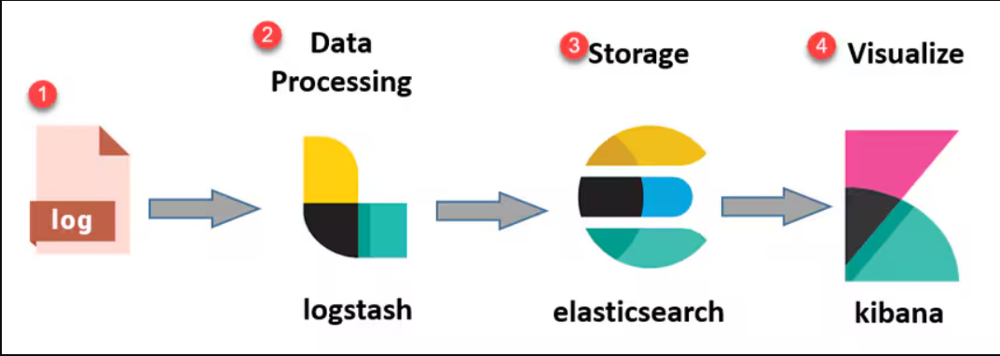

# ES|QL

### সোর্স কমান্ড

```esql
1. FROM = যে সোর্স ডেটার উপর কাজ করতে চাই সেই সোর্স কে সিলেক্ট
```

#### উদাহরণ

```esql
FROM Linux*
```

### প্রসেসিং কম্যান্ড

```esql
1. CHANGE_POINT
2. COMPLETION
3. DISSECT = এটি ১ টি স্ট্রিং কে ভেঙে ছোট ছোট ভাগে ভাগ করে
4. DROP = ড্রপ সাধারণত এক বা একাধিক কালাম কে রিমোভ করে
5. ENRICH
6. EVAL = "EVAL" হচ্ছে Elasticsearch-এর একটা ফিচার, যেটা সার্চ রেজাল্টের ওপর নানান ধরনের কাস্টম ক্যালকুলেশন বা এক্সপ্রেশন চালাতে দেয়।
7. GROK = GROK এমন একটা প্যাটার্ন ম্যাচিং টুল যা এলাসটিকসার্চ সিস্টেমে লগ বা আনস্ট্রাকচার্ড ডেটা থেকে নির্দিষ্ট ফিল্ড বা তথ্য বের করতে সাহায্য করে। অর্থাৎ, এলোমেলো টেক্সটকে ধরাছোঁয়া করে কাঠামোবদ্ধ তথ্য বানানোই এর কাজ।
8. FORK = FORK হলো ES|QL-এর একটা কমান্ড, যেটা দিয়ে তুমি একই ডেটা থেকে একসাথে একাধিক আলাদা অ্যালালাইসিস বা কাজ করতে পারো। ধরো, একটা ডেটাসেট থেকে তুমি একই সঙ্গে কয়েকটা ভিন্ন কোয়েরি চালাতে চাও – FORK কমান্ড সেটাই করতে দেয়। অর্থাৎ, একবার ডেটা নিয়ে সেটাকে আলাদা আলাদা রাস্তা বা ব্রাঞ্চে ভাগ করে আলাদা আলাদা ফলাফল বের করা যায়।
9. FUSE = ES|QL এ FUSE কমান্ড, এটি মূলত ভিন্ন দুটি ডেটাসেটকে একত্রে মিশিয়ে দেওয়ার মতো একটি পদ্ধতি। ধরো, তোমার দুটি আলাদা আলাদা কোয়েরি বা ডেটাসেট আছে, এবং তুমি চাইছো সেই দুটি ফলাফল একসাথে যুক্ত করতে। FUSE কমান্ড ব্যবহার করে তুমি সেগুলোকে এমনভাবে মিলিয়ে দিতে পারো, যেন একটাই ডেটাসেট বা টেবিল হয়ে যায়।
10. KEEP = ES|QL এ KEEP মানে হলো, কোন কোন ফিল্ড (column) তুমি শেষ আউটপুটে দেখতে চাও সেটা বেছে নেওয়া। সহজ কথায় অপ্রয়োজনীয় ফিল্ড ফেলে দিয়ে দরকারি ফিল্ড রাখা।
11. LIMIT = LIMIT মানে হলো আউটপুটে সর্বোচ্চ কতটা রেকর্ড (row) দেখাবে, সেটা নির্ধারণ করা
12. LOOKUP JOIN = LOOKUP JOIN মানে হলো একটা ডেটাসেটের সাথে আরেকটা reference / lookup ডেটাসেট মিলিয়ে তথ্য যোগ করা
সহজ কথায়: একটা টেবিল দেখে আরেকটা টেবিল থেকে বাড়তি তথ্য এনে লাগানো
এটা মূলত SQL-এর LEFT JOIN–এর মতো।
13. INLINE STATS
14. MV_EXPAND
15. Stack
16. WHERE
```

### 3. DISSECT

```esql
DISSECT = এটি ১ টি স্ট্রিং কে ভেঙে ছোট ছোট ভাগে ভাগ করে
```

#### উদাহরণ - ১

#### কমান্ড

```esql
FROM linux*
| KEEP log.source.address
```

#### আউটপুট

```esql
172.16.201.224:51853
```

#### উদাহরণ - ২

#### কমান্ড

```
FROM linux*
| DISSECT log.source.address  """%{a}:%{b}"""
| KEEP a, b
```

#### আউটপুট

```esql
a	            b
--------------------
172.16.201.4 | 54970
172.16.201.4 | 54970
```

### 4. DROP

```esql
DROP = ড্রপ সাধারণত এক বা একাধিক কালাম কে রিমোভ করে
```

#### উদাহরণ - ১

#### কমান্ড

```esql
FROM linux*
| KEEP @timestamp, log.source.address, @version

* এখানে আমি ৩ টি কলাম নিয়ে কোয়েরি টি চালালাম। এই কোয়েরিতে তিনটি ফিল্ডের ডাটা দেখাবে
```

#### আউটপুট

```esql
@timestamp	             | log.source.address	| @version
---------------------------------------------------------
2026-01-15T16:50:20.595Z | 172.16.201.4:54970	| 1
2026-01-15T17:14:57.424Z | 172.16.201.4:54970	| 1
```

#### উদাহরণ - ২

#### কমান্ড

```esql
FROM linux*
| KEEP @timestamp, log.source.address, @version
| DROP @timestamp
```

#### আউটপুট

```esql
log.source.address	| @version
------------------------------
172.16.201.4:54970	| 1
172.16.201.4:54970	| 1

* এখানে উপরের কমান্ডের আউটপুট এর সাথে পার্থক্য করলে দেখা যাবে @timestamp কালাম টি নাই
```

### 6. EVAL

```esql
EVAL = "EVAL" হচ্ছে Elasticsearch-এর একটা ফিচার, যেটা সার্চ রেজাল্টের ওপর নানান ধরনের কাস্টম ক্যালকুলেশন বা এক্সপ্রেশন চালাতে দেয়।
```

#### উদাহরণ - ১

#### কমান্ড

```esql
FROM linux*
| KEEP @timestamp, log.source.address, @version
| DROP @timestamp
| EVAL newVersion = TO_INTEGER(@version) + 1
```

#### আউটপুট

```esql
{
  "log.source.address": "172.16.201.4:54970",
  "@version": "1",
  "newVersion": 2
}
Note: এই কয়েরিতে আমরা যদি লক্ষ্য করি তবে দেখতে পাবো যে EVAL দিয়ে আমি একটি নতুন কলাম যুক্ত করেছি যার নাম newVersion যেটা @version এর সাথে এক যোগ করে একটি নতুন আউটপুট জেনারেট করে। আউটপুট আমি json  ফরমেটে রাখলাম।
এটাতে আরো কিছু এগ্রিগেশন কমান্ড ব্যবহার করা যায়।
```

### 7. GROK

```esql
GROK = GROK এমন একটা প্যাটার্ন ম্যাচিং টুল যা এলাসটিকসার্চ সিস্টেমে লগ বা আনস্ট্রাকচার্ড ডেটা থেকে নির্দিষ্ট ফিল্ড বা তথ্য বের করতে সাহায্য করে। অর্থাৎ, এলোমেলো টেক্সটকে ধরাছোঁয়া করে কাঠামোবদ্ধ তথ্য বানানোই এর কাজ।

GROK আর DISSECT দুটোই লগ বা টেক্সট থেকে কাঠামোবদ্ধ তথ্য বের করার টুল, কিন্তু GROK একটু বেশি শক্তিশালী এবং প্যাটার্ন-ম্যাচিং বেইজড। মানে, তুমি যদি খুব নির্দিষ্ট ফরম্যাটে টেক্সট থাকে, সেখানে GROK দিয়ে নানা রকম প্যাটার্ন মিলিয়ে তথ্য বের করতে পারো। আর DISSECT হলো একটু সিম্পল, এটা নির্দিষ্ট ডিলিমিটার বা সেপারেটর ধরে ধরে টেক্সটকে ভাগ করে ফেলে। অর্থাৎ, GROK বেশি ফ্লেক্সিবল আর জটিল টেক্সট হ্যান্ডেল করতে পারে, আর DISSECT সিম্পল আলাদা-আলাদা অংশ বের করতে সহজ।

** Built-in Grok Patterns list

-------------------------------------------------------------------------------------------------
Type            |   Pattern       |            Description
--------------------------------------------------------------------------------------------------
Common patterns	| EXTRACTJSON	  | Matches JSON data.
                | CHINAID	      | Matches the numbers of identity cards of Chinese residents.
                | USERNAME	      | Matches content that contains letters, digits, and . _-.
                | USER	          | Matches content that contains letters, digits, and . _-.
                | EMAILLOCALPART  | Matches the characters before the at sign (@) in an
                                email address. For example, in the email address 123456@alibaba.com, the matched content is 123456.
                | EMAILADDRESS    |Matches email addresses.
                | HTTPDUSER	      |Matches email addresses or usernames.
                | INT	          |Matches integers.
                | BASE10NUM	      |Matches decimal numbers.
                | NUMBER	      |Matches numbers.
                | BASE16NUM	      |Matches hexadecimal numbers.
                | BASE16FLOAT	  |Matches hexadecimal floating-point numbers.
                | POSINT	      |Matches positive integers.
                | NONNEGINT	      |Matches non-negative integers.
                | WORD	          |Matches letters, digits, and underscores (_).
                | NOTSPACE	      |Matches characters that are not spaces.
                | SPACE	          |Matches spaces.
                | DATA	          |Matches line feeds.
                | GREEDYDATA	  |Matches zero or multiple characters that are not line feeds.
                | QUOTEDSTRING	  |Matches quoted content. For example, in the I am "Iro| Man"
                                string, the matched content is Iron Man.
                | UUID	          |Matches universally unique identifiers (UUIDs).
--------------------------------------------------------------------------------------------------
Networking	    | MAC	          | Matches MAC addresses.
                | CISCOMAC	      | Matches Cisco MAC addresses.
                | WINDOWSMAC      | Matches Windows MAC addresses.
                | COMMONMAC	      | Matches common MAC addresses.
                | IPV6	          | Matches IPv6 addresses.
                | IPV4	          | Matches IPv4 addresses.
                | IP	          | Matches IPv6 or IPv4 addresses.
                | HOSTNAME	      | Matches hostnames.
                | IPORHOST	      | Matches IP addresses or hostnames.
                | HOSTPORT	      | Matches IP addresses, hostnames, or positive integers.
--------------------------------------------------------------------------------------------------
Paths	        | PATH	          | Matches UNIX paths or Windows paths.
                | UNIXPATH	      | Matches UNIX paths.
                | WINPATH	      | Matches Windows paths.
                | URIPROTO	      | Matches URI schemes. For example, in http://hostname.domain.tld/
                                _astats?application=&inf.name=eth0, the matched content is http.
                | TTY	          | Matches tty paths.
                | URIHOST	      | Matches IP addresses, hostnames, or positive integers. For
                                example, in http://hostname.domain.tld/_astats?application=&inf.name=eth0, the matched content is hostname.domain.tld.
                | URI	          | Matches URIs.
--------------------------------------------------------------------------------------------------
				| MONTH	          | Matches months that are in the numeric, abbreviated, or
                                  full-name format.
                | MONTHNUM	      | Matches months that are in the numeric format.
Date            | MONTHDAY	      | Matches days in a month.
                | DAY	          | Matches weekdays that are in the abbreviated or full-name
                                  format.
                | YEAR	          | Matches years.
--------------------------------------------------------------------------------------------------
		        | HOUR	          | Matches hours.
                | MINUTE	      | Matches minutes.
                | SECOND	      | Matches seconds.
                | TIME	          | Matches time.
                | DATE_US	      | Matches dates in the Month-Day-Year or Month/Day/Year format.
                | DATE_EU	      | Matches dates in the Day-Month-Year, Day/Month/Year or Day.
                                  Month.Year format.
                | DATE	          | Matches dates that are in the US or EU format.
Time	        | DATESTAMP	      | Matches dates and time.
                | TZ	          | Matches UTC time zones.

                | ISO8601_TIMEZONE	  | Matches hours and minutes that are in the ISO 8601 format.
                | ISO8601_SECOND      | Matches seconds that are in the ISO 8601 format.
                | TIMESTAMP_ISO8601	  | Matches time that is in the ISO 8601 format.
                | DATESTAMP_RFC822	  | Matches time that is in the RFC 822 format.
                | DATESTAMP_RFC2822	  | Matches time that is in the RFC 2822 format.
                | DATESTAMP_OTHER	  | Matches time that is in other formats.
                | DATESTAMP_EVENTLOG  | Matches time that is in the EventLog format.
                | HTTPDERROR_DATE	  | Matches time that is in the httpd error format.
--------------------------------------------------------------------------------------------------
				| SYSLOGTIMESTAMP	    | Matches time that is in the Syslog format.
                | PROG	                | Matches programs.
                | SYSLOGPROG	        | Matches programs and process identifiers (PIDs).
SYSLOG          | SYSLOGHOST	        | Matches IP addresses or hostnames.
                | SYSLOGFACILITY	    | Matches facilities.
                | HTTPDATE	            | Matches dates and time that are in the HTTP format.
--------------------------------------------------------------------------------------------------
	   		    | LOGFORMAT	            | Matches Syslog logs that are in the traditional format.
                | COMMONAPACHELOG	    | Matches common Apache logs.
                | COMBINEDAPACHELOG	    | Matches combined Apache logs.
LOGFORMATL      | HTTPD20_ERRORLOG	    | Matches httpd20 logs.
                | HTTPD24_ERRORLOG	    | Matches httpd24 logs.
                | HTTPD_ERRORLOG	    | Matches httpd logs.
--------------------------------------------------------------------------------------------------
LOGLEVELS	    | LOGLEVELS	            | Matches log levels, such as warn and debug.
```

#### উদাহরণ - ১

#### কমান্ড

```esql
FROM linux*
| WHERE message LIKE "*flapping*"
| GROK message "%{MAC:vlan}"
| GROK message "Host %{NOTSPACE:host} in vlan %{INT:vlan} is flapping between port %{NOTSPACE:port_1} and port %{NOTSPACE:port_2}"
| GROK log.source.address "%{IP:ip}:%{INT:port}"
| KEEP host, vlan, port_1, port_2, ip, port
```

#### আউটপুট

```esql
{
  "host": "c0e4.34bc.8adb",
  "vlan": "300",
  "port_1": "Te1/0/20",
  "port_2": "Te1/0/17",
  "ip": "172.16.201.14",
  "port": "50943"
}
```

### 8. FORK

```esql
FORK = FORK হলো ES|QL-এর একটা কমান্ড, যেটা দিয়ে তুমি একই ডেটা থেকে একসাথে একাধিক আলাদা অ্যালালাইসিস বা কাজ করতে পারো। ধরো, একটা ডেটাসেট থেকে তুমি একই সঙ্গে কয়েকটা ভিন্ন কোয়েরি চালাতে চাও – FORK কমান্ড সেটাই করতে দেয়। অর্থাৎ, একবার ডেটা নিয়ে সেটাকে আলাদা আলাদা রাস্তা বা ব্রাঞ্চে ভাগ করে আলাদা আলাদা ফলাফল বের করা যায়।
```

#### উদাহরণ - ১

#### কমান্ড

```esql
FROM linux*
| FORK ( WHERE log.source.address LIKE "172.16.201.*") ( WHERE event.severity == 1 )
| KEEP log.source.address, event.severity , message
```

#### আউটপুট

```esql
{
  "log.source.address": "172.16.201.13:1029",
  "event.severity": 1,
  "message": "Switch 1: power supply A is not responding"
}
```

### 9. FUSE

```esql
ES|QL এ FUSE কমান্ড, এটি মূলত ভিন্ন দুটি ডেটাসেটকে একত্রে মিশিয়ে দেওয়ার মতো একটি পদ্ধতি। ধরো, তোমার দুটি আলাদা আলাদা কোয়েরি বা ডেটাসেট আছে, এবং তুমি চাইছো সেই দুটি ফলাফল একসাথে যুক্ত করতে। FUSE কমান্ড ব্যবহার করে তুমি সেগুলোকে এমনভাবে মিলিয়ে দিতে পারো, যেন একটাই ডেটাসেট বা টেবিল হয়ে যায়।
```

### 10. KEEP

```esql
ES|QL এ KEEP মানে হলো, কোন কোন ফিল্ড (column) তুমি শেষ আউটপুটে দেখতে চাও সেটা বেছে নেওয়া। সহজ কথায় অপ্রয়োজনীয় ফিল্ড ফেলে দিয়ে দরকারি ফিল্ড রাখা।
```

#### উদাহরণ - ১

#### কমান্ড

```esql
FROM linux*
| FORK ( WHERE log.source.address LIKE "172.16.201.*") ( WHERE event.severity == 1 )
| KEEP log.source.address, event.severity , message
```

#### আউটপুট

```esql
{
  "log.source.address": "172.16.201.20:50346",
  "event.severity": 4,
  "message": "Native VLAN mismatch discovered on GigabitEthernet1/0/23 (7), with Switch GigabitEthernet0/1 (1)."
}
```

### 11. LIMIT

```esql
LIMIT মানে হলো আউটপুটে সর্বোচ্চ কতটা রেকর্ড (row) দেখাবে, সেটা নির্ধারণ করা
```

#### উদাহরণ - ১

#### কমান্ড

```esql
FROM linux*
| WHERE message LIKE "*error*"
| LIMIT 20
```

### 12. LOOKUP JOIN

```esql
LOOKUP JOIN মানে হলো একটা ডেটাসেটের সাথে আরেকটা reference / lookup ডেটাসেট মিলিয়ে তথ্য যোগ করা
সহজ কথায়: একটা টেবিল দেখে আরেকটা টেবিল থেকে বাড়তি তথ্য এনে লাগানো
এটা মূলত SQL-এর LEFT JOIN–এর মতো।
```

#### উদাহরণ - ১

#### কমান্ড

```esql
FROM logs
| LOOKUP JOIN ip_lookup
  ON ip
| KEEP ip, message, country
```
